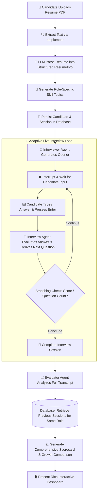

# 🧞 Interview Genie — AI-Powered Adaptive Technical Interview Platform

[](https://www.python.org/)
[](https://github.com/langchain-ai/langgraph)
[](https://openai.com/)
[](https://fastapi.tiangolo.com/)
[](https://streamlit.io/)
[](https://learn.microsoft.com/en-us/sql/)

> **Interview Genie** is an enterprise-ready, state-managed mock technical interview platform. By pairing **LangGraph** workflow orchestration with the **OpenAI SDK**, it extracts candidate competencies from uploaded resumes, tailor-fits technical questions to target job roles, conducts real-time adaptive dialogues, and evaluates candidate readiness against industry-standard rubrics.

---

## 🌟 Key Highlights

- **📄 Intelligent Resume Parsing**: Extracts raw text using `pdfplumber` and `pypdf`, converting unstructured PDF resumes into structured Pydantic schemas (`ResumeInfo`) via OpenAI Structured Outputs.
- **🎯 Dynamic Role-Based Topic Preparation**: Automatically maps resume skills against target role requirements, generating difficulty-tagged interview topics (`basic`, `intermediate`, `advanced`).
- **🎙️ Realistic, Human-Like Interviewer Agent**:
  - **No Cliché Openers**: Starts naturally with a warm welcome and background overview—strictly avoiding premature project drills or emotional clichés (*"What project are you most proud of?"*).
  - **Organic Answer-Driven Direction**: Every subsequent technical question is directly inspired by what the candidate just stated in their response.
  - **No Sycophantic Filler**: Avoids robotic appraisal words (*"Great!"*, *"I understand"*, *"Awesome!"*).
  - **Balanced Technical Breadth**: Probes core engineering principles without trapping candidates in endless rabbit holes on a single topic.
  - **Composed Redirection & Strict Scoring**: If a candidate attempts to evade, joke, or misbehave, the interviewer firmly redirects them and penalizes turn scores (0–2).
  - **Zero Dialogue Score Leakage**: Numeric turn scores (0–10) are tracked strictly behind the scenes in JSON payloads.
- **🔄 State-Managed LangGraph Architecture**: Built with state persistence, human-in-the-loop interrupts (`interrupt`), and conditional branching based on cumulative candidate performance.
- **📊 In-Depth Evaluator & Historical Growth Tracking**:
  - Delivers an end-of-session scorecard with readiness ratings, skill breakdowns, strengths, improvement areas, and actionable recommendations.
  - **Cross-Session Trajectory Comparison**: Automatically compares subsequent interview attempts for the *same candidate and role*, highlighting historical growth and recurring gaps.
- **🖥️ Distraction-Free Focus Mode UI**:
  - Live interview screen hides sidebar navigation and metrics to keep attention focused on technical dialogue.
  - Instant **Enter-to-Submit** input with automatic field clearing.
- **🔌 Dual-Engine Database Architecture**:
  - **Enterprise**: Production-grade **Microsoft SQL Server** via `pyodbc`.
  - **Cloud/Portability**: Zero-configuration embedded **SQLite** for serverless, one-click deployments on **Streamlit Community Cloud**.
- **⚡ Hybrid Execution Client**: Automatically operates either via high-performance **FastAPI REST endpoints** or **in-process** when deployed to serverless environments.

---

## 📐 System Architecture & Flow



---

## 📂 Repository Structure

```plaintext
interview-genie/
├── .devcontainer/                  # Development container configuration
├── .streamlit/
│   ├── config.toml                 # Streamlit UI theme and server configuration
│   └── secrets.toml.example        # Template for deployment secrets
├── src/
│   └── interview_genie/
│       ├── agents/
│       │   ├── resume_parser.py    # Extracts text & parses PDF into structured schema
│       │   ├── interview_prep.py   # Generates difficulty-tiered interview topics
│       │   ├── interview_agent.py  # Conversational interviewer with turn scoring
│       │   └── evaluator_agent.py  # Final scorecard & historical growth analysis
│       ├── api/
│       │   ├── routes.py           # FastAPI REST endpoints (Auth, Interview, Health)
│       │   ├── schemas.py          # Request & Response Pydantic models
│       │   └── deps.py             # Shared API dependencies
│       ├── database/
│       │   ├── db.sql              # MS SQL Server DDL schema definition
│       │   ├── db_conn.py          # SQL Server connection manager & query handlers
│       │   └── sqlite_conn.py      # SQLite zero-configuration driver (Cloud mode)
│       ├── graph/
│       │   ├── state.py            # LangGraph state definitions
│       │   ├── nodes.py            # Workflow nodes & human-in-the-loop logic
│       │   └── build_graph.py      # StateGraph compilation with memory checkpointer
│       ├── Models/
│       │   └── schema.py           # Core Pydantic data schemas
│       ├── utils/
│       │   └── auth.py             # Candidate password hashing (Bcrypt) & auth logic
│       └── main.py                 # FastAPI application entrypoint
├── ui/
│   ├── app.py                      # Multi-stage Streamlit web application
│   ├── api_client.py               # Hybrid API client (FastAPI + In-Process fallback)
│   ├── styles.py                   # Custom CSS styling (clean focus mode, cards)
│   └── utils.py                    # UI rendering helpers
├── uploads/
│   └── resumes/                    # Storage directory for uploaded candidate PDFs
├── DEPLOYMENT.md                   # Step-by-step guide for Streamlit Community Cloud
├── pyproject.toml                  # Project metadata & uv dependency configuration
├── requirements.txt                # Pip requirements for cloud deployment
├── sample_resume.pdf               # Bundled sample resume for quick testing
├── streamlit_app.py                # Cloud root entrypoint for Streamlit deployment
└── README.md                       # Comprehensive project documentation
```

---

## 🛠️ Technology Stack

| Domain | Technology / Framework | Purpose |
| :--- | :--- | :--- |
| **Agent Orchestration** | [LangGraph](https://github.com/langchain-ai/langgraph) | Stateful graph execution, conditional branching, human-in-the-loop interrupts |
| **Language Model** | [OpenAI SDK](https://github.com/openai/openai-python) | GPT models with structured outputs for parsing, interview turns, and evaluation |
| **Backend REST API** | [FastAPI](https://fastapi.tiangolo.com/) + [Uvicorn](https://www.uvicorn.org/) | High-performance async microservice for interview sessions & authentication |
| **Frontend UI** | [Streamlit](https://streamlit.io/) | Interactive web UI with Focus Mode, live chat, and metric dashboards |
| **Data Validation** | [Pydantic v2](https://docs.pydantic.dev/) | Strict data validation and schema enforcement across graph states and APIs |
| **Document Ingestion** | [pdfplumber](https://github.com/jsvine/pdfplumber) & [pypdf](https://github.com/py-pdf/pypdf) | High-fidelity text extraction from candidate PDF resumes |
| **Databases** | Microsoft SQL Server & SQLite | Dual-engine support: Enterprise relational database + portable cloud database |
| **Security** | [Bcrypt](https://pypi.org/project/bcrypt/) | Secure password hashing for candidate accounts |

---

## 🚀 Quickstart & Local Setup

### 1. Prerequisites
- **Python 3.11+** (Python 3.14 supported)
- An **OpenAI API Key** ([platform.openai.com](https://platform.openai.com/api-keys))
- *(Optional)* Microsoft SQL Server if you prefer testing with enterprise SQL Server locally. Otherwise, SQLite is used automatically with zero setup.

### 2. Clone the Repository
```bash
git clone https://github.com/mbhise490/interview-genie.git
cd interview-genie
```

### 3. Set Up Environment & Dependencies

Using [`uv`](https://github.com/astral-sh/uv) (recommended):
```bash
uv venv
uv sync
```

Or using standard `pip`:
```bash
python -m venv .venv
# Windows:
.venv\Scripts\activate
# Linux/macOS:
source .venv/bin/activate

pip install -r requirements.txt
```

### 4. Configure Environment Variables
Create a `.env` file in the root directory:
```env
# Required: OpenAI API Key
OPENAI_API_KEY=sk-proj-your-openai-api-key-here

# Database Configuration (Optional: default is SQLite)
USE_SQLITE=true

# If using Microsoft SQL Server:
# DB_SERVER=localhost
# DB_NAME=InterviewGenie
# DB_USER=sa
# DB_PASSWORD=your_password
```

---

## 🏃 Running the Application

### Option A: Standalone Streamlit UI (Fastest)
The Streamlit app features a hybrid execution client that runs the LangGraph workflows and database in-process without requiring a separate server:
```bash
uv run streamlit run streamlit_app.py
```
Open your browser at `http://localhost:8501`.

### Option B: Full Client-Server Architecture (FastAPI + Streamlit)
To run the decoupled production microservices:

1. **Start the FastAPI Backend**:
   ```bash
   uv run uvicorn src.interview_genie.main:app --host 0.0.0.0 --port 8000 --reload
   ```
   *Interactive API Docs will be available at: `http://localhost:8000/docs`.*

2. **Start the Streamlit Frontend**:
   ```bash
   uv run streamlit run streamlit_app.py
   ```

---

## ☁️ Cloud Deployment (Streamlit Community Cloud)

Interview Genie is fully configured for instantaneous, zero-cost deployment on **[Streamlit Community Cloud](https://share.streamlit.io)**:

1. **Push your code to GitHub**.
2. **Link repository** in Streamlit Cloud and set `Main file path` to `streamlit_app.py`.
3. In **Settings ➔ Secrets**, configure:
   ```toml
   OPENAI_API_KEY = "sk-proj-YOUR_OPENAI_API_KEY"
   USE_SQLITE = "true"
   ```
4. Click **Deploy!** — your app is live on the web in 1–2 minutes.

> For detailed deployment steps, consult [`DEPLOYMENT.md`](file:///d:/Mine/projects/Interview%20Genie/DEPLOYMENT.md).

---

## 📡 API Reference Overview

The FastAPI backend exposes the following primary endpoints:

| Method | Endpoint | Description |
| :--- | :--- | :--- |
| `POST` | `/auth/register` | Register a new candidate account with bcrypt hashing. |
| `POST` | `/auth/login` | Authenticate an existing candidate. |
| `POST` | `/api/interview/start` | Ingests PDF resume, parses background, generates topics, and kicks off graph. |
| `POST` | `/api/interview/answer` | Submits candidate answer, executes agent reasoning, returns next question & score. |
| `POST` | `/api/interview/end` | Concludes interview and triggers Evaluator Agent to generate scorecard. |
| `GET` | `/api/candidates/{id}/history` | Retrieves historical interview performance records for a candidate. |
| `GET` | `/api/health` | Validates backend uptime and database connection status. |

---

## 📊 Database Schema

Interview Genie maintains candidate records across three normalized entities:

```
[ candidates ]
  ├── candidate_id (PK, UUID)
  ├── email (Unique)
  ├── password_hash (Bcrypt)
  ├── full_name
  └── created_at

[ resume_info ]
  ├── resume_id (PK, Identity)
  ├── candidate_id (FK -> candidates)
  ├── target_role
  ├── resume_text
  ├── parsed_skills, parsed_projects, parsed_experience
  └── created_at

[ interview ]
  ├── interview_id (PK, Identity)
  ├── thread_id (Unique, LangGraph Thread)
  ├── candidate_id (FK -> candidates)
  ├── target_role
  ├── status (not_started / in_progress / completed)
  ├── question_count
  ├── total_score, average_score
  ├── conversation_history (JSON Array of Questions, Answers, and Turn Scores)
  ├── evaluation_report (JSON Scorecard: Strengths, Weaknesses, Growth Analysis)
  └── created_at, updated_at
```

---

## 🤝 Contributing

Contributions, feedback, and issue submissions are welcome!
1. Fork the Project.
2. Create your Feature Branch (`git checkout -b feature/AmazingFeature`).
3. Commit your Changes (`git commit -m "feat: add AmazingFeature"`).
4. Push to the Branch (`git push origin feature/AmazingFeature`).
5. Open a Pull Request.

---

## 📜 License

Distributed under the **MIT License**. See `LICENSE` for more information.

---

<p align="center">
  Built with ❤️ by <a href="https://github.com/mbhise490">Mahesh Bhise</a>
</p>
